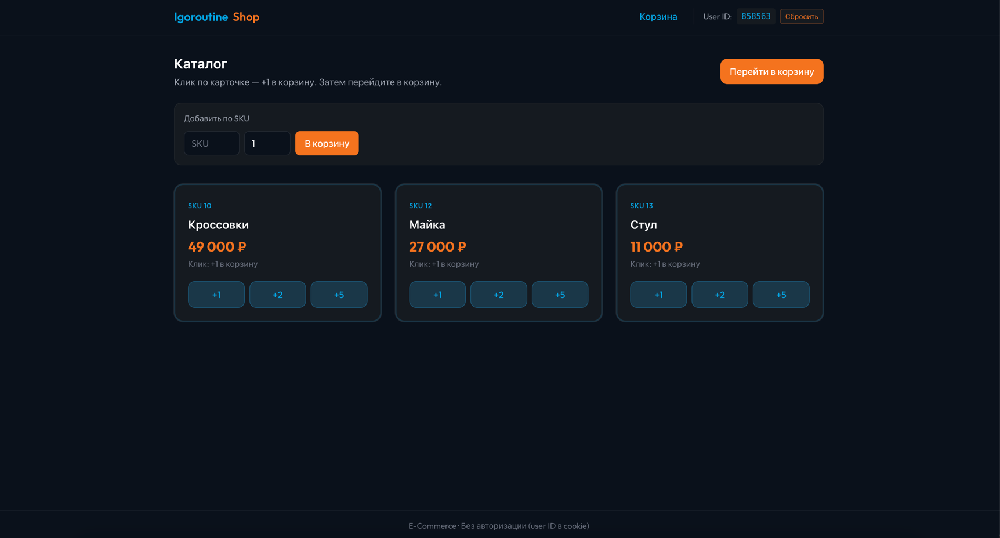
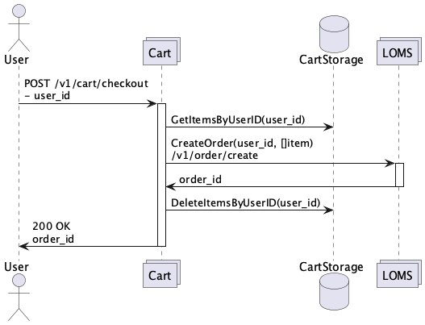
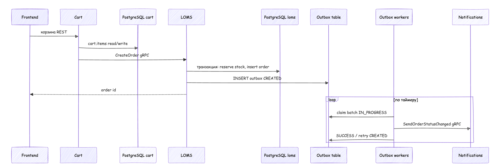

# E-Commerce Microservices

Микросервисное backend-приложение на Go, моделирующее ключевые процессы интернет-магазина:
работу корзины, управление каталогом и остатками, оформление и оплату заказов, а также асинхронные уведомления через outbox-pattern.

## Интерфейс магазина



## Архитектура

Каждый backend-сервис построен по единым архитектурным принципам:
доменная логика отделена от транспортного слоя и инфраструктуры, зависимости инвертированы через интерфейсы, а внешние интеграции вынесены в адаптеры.

Основные слои:

- `entity` — доменные модели
- `usecase` — бизнес-логика
- `controller` — gRPC / grpc-gateway слой
- `repository` — PostgreSQL / in-memory доступ к данным
- `adapter` — внешние интеграции
- `app` — сборка зависимостей и запуск


## Сервисы

### `cart`
Сервис корзины пользователя. Отвечает за добавление и удаление товаров, просмотр корзины, очистку и checkout.

- `AddItem`
- `DeleteItem`
- `ListCart`
- `ClearCart`
- `CheckoutCart`

### `loms`
Logistics and Order Management System. Отвечает за каталог, остатки, создание и жизненный цикл заказа.

- `CreateProduct`, `GetProduct`
- `SetStock`, `GetStock`
- `CreateOrder`, `GetOrder`, `PayOrder`, `CancelOrder`

### `notifications`
Сервис доставки внешних уведомлений. Получает события по gRPC и отправляет HTTP callback, в том числе через асинхронный outbox-процессинг.


## Основные сценарии

### Cart

`AddItem`


`ListCart`


`CheckoutCart`



### LOMS

`CreateOrder`


`PayOrder`


`CancelOrder`


## Сервисное взаимодействие



## Технологии

- Go 1.25
- gRPC
- grpc-gateway
- Protocol Buffers
- PostgreSQL 17
- Kafka
- Goose migrations
- Docker / Docker Compose


## Структура репозитория

- `cart/` - сервис корзины.
- `loms/` - сервис заказов, каталога и остатков.
- `notifications/` - сервис доставки callback-уведомлений.
- `frontend/` - UI для локальной проверки.
- `pkg/generated/` - сгенерированный код protobuf/gRPC.
- `integration-tests/` - интеграционные тесты.
- `docs/` - диаграммы и визуальные материалы.

## Technical Highlights

- Clean Architecture с разделением на `entity`, `usecase`, `controller`, `repository`, `adapter`
- gRPC API + HTTP доступ через grpc-gateway
- PostgreSQL + goose migrations
- In-memory и PostgreSQL реализации repository
- Асинхронные уведомления через outbox pattern
- Kafka как брокер сообщений для событийной интеграции
- Интеграционные тесты в Docker Compose

## Быстрый старт

Требования:

- Docker + Docker Compose
- Go 1.25+
- Node.js

Запуск backend:

```bash
task backend
```

Запуск frontend:

```bash
task frontend
```

Полный прогон тестов:

```bash
task test
```

Проверка линтером:

```bash
task lint
```

## Генерация кода

Быстрая генерация кода
```bash
task fast-generate:
```

Обычная генерация кода:
```bash
task generate
```
